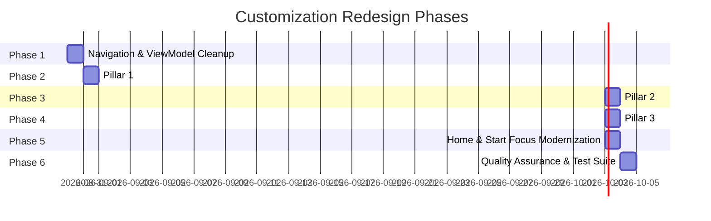

# 🚀 Focus Clock UI/UX Architecture & Customization Redesign Plan

## 1. Executive Summary & Google Modern Android Architecture (MAD) Alignment

This document outlines the professional, scalable, and phased architectural execution plan to transform the Focus Clock application into a streamlined, high-performance, studio-grade Android app.

### The Problem Addressed
Previously, visual clock and canvas customization was fragmented across separate screens (`ClockSettingsScreen`, `BackgroundSettingsScreen`), floating bottom sheets (`ClockStyleBottomSheet`, `ClockFontBottomSheet`), and dialogs. This caused cognitive overload and visual clutter.

### The 3-Pillar Solution Architecture

```
                               ┌────────────────────────────────────────────────────────┐
                               │                 MAIN APPLICATION ROUTER                │
                               └───────────────────────────┬────────────────────────────┘
                                                           │
              ┌────────────────────────────────────────────┼────────────────────────────────────────────┐
              │                                            │                                            │
┌─────────────▼────────────────────────────┐ ┌─────────────▼────────────────────────────┐ ┌──────────────▼───────────────────────────┐
│  PILLAR 1: CLOCK & CANVAS CUSTOMIZER     │ │  PILLAR 2: SOUNDSCAPE & MUSIC PLAYER     │ │  PILLAR 3: APP SETTINGS & PREFERENCES    │
│  (Single Dedicated Studio Screen)        │ │  (Single Dedicated Audio Screen)         │ │  (Consolidated System Screen)            │
├──────────────────────────────────────────┤ ├──────────────────────────────────────────┤ ├──────────────────────────────────────────┤
│ • Sticky Synchronized Live Hero Preview  │ │ • Soundscape Track Catalog (Built-in)    │ │ • Default Focus Duration & Presets       │
│ • Tab 1: Clock Dial Style                │ │ • Custom Track Manager (SAF & YouTube)   │ │ • Timer Display Mode (Countdown/Elapsed) │
│ • Tab 2: Typography & Google Fonts (23+) │ │ • Inline Preview Play / Pause Audition   │ │ • Display Wakelock & Auto-Hide Controls  │
│ • Tab 3: Background (Solid/Photo/Slides) │ │ • Auto-Play on Focus Start & Loop Mode   │ │ • AMOLED Battery Saver Mode              │
│ • Tab 4: Readability Dimming & Date/Time │ │ • Audio Waveform Visualizer Toggle       │ │ • Harmonic Chimes, Haptics, Notifications│
│                                          │ │ • Master Volume Output Slider            │ │ • About & Factory Reset                  │
└──────────────────────────────────────────┘ └──────────────────────────────────────────┘ └──────────────────────────────────────────┘
```

---

## 2. Phased Roadmap & Manageable Milestones



---

### 🔹 Milestone 1: Navigation & State Foundation
**Goal**: Restructure application routes and clean up ViewModel state.

* **Task 1.1 — Route Consolidation in `AppNavigation.kt`**:
  * Define `Screen.ClockCanvas` (`"clock_canvas"`), `Screen.Soundscape` (`"soundscape"`), and `Screen.SettingsHub` (`"settings_hub"`).
  * Deprecate separate old routes and clean up transitions.
* **Task 1.2 — ViewModel Clean-up in `FocusViewModel.kt`**:
  * Remove duplicate `fun stopPlayer()` definition.
  * Ensure reactive state flows (`FocusUiState`) expose clean parameters for the unified studio tabs.
  * Ensure preview audio stops automatically when departing screens unless a session is running.

**Deliverables**:
- Clean `AppNavigation.kt` route map.
- Bug-free `FocusViewModel.kt`.

---

### 🔹 Milestone 2: Pillar 1 — Dedicated Clock & Canvas Customizer
**Goal**: Build the unified visual studio screen consolidating all dial styles, fonts, backgrounds, slideshows, and dimming into one screen with a sticky live preview.

* **Task 2.1 — Sticky Hero Preview Component**:
  * Pinned top card rendering `ClockRenderer` (current style + selected Google Font + date) over `FocusBackground` (solid color, custom photo, or slideshow) with the exact overlay dimming applied.
* **Task 2.2 — Material 3 Primary Tab Row**:
  * **Tab 1: Clock Style & Dial**: Visual cards for `Clean Digital`, `Minimal`, `Flip Clock`, `Analog`.
  * **Tab 2: Typography & Google Fonts**: 23 tall, condensed display fonts with live sample preview boxes showing `"10:45"` in each font.
  * **Tab 3: Background Engine**:
    * Solid Color (AMOLED black, curated palettes + custom HEX input with validation).
    * Single Photo (Photo picker with SAF persistable permissions, replace/remove actions).
    * Slideshow (Multi-photo picker, horizontal scrolling gallery, interval chips 5s..10m, shuffle toggle).
  * **Tab 4: Readability Dimming & Date/Time**:
    * 0% to 70% contrast protection slider with live preview feedback.
    * 12h / 24h toggle, Show Date toggle, Show Day of Week toggle, Date pattern selector.
* **Task 2.3 — Retirement of Floating Bottom Sheets**:
  * Retire `ClockStyleBottomSheet.kt` and `ClockFontBottomSheet.kt` to eliminate visual clutter.

**Deliverables**:
- `ClockCanvasSettingsScreen.kt` (or `ClockCustomizerScreen.kt`).
- Complete elimination of multi-menu visual customization jumping.

---

### 🔹 Milestone 3: Pillar 2 — Dedicated Soundscape & Music Player
**Goal**: Create a dedicated sound manager for ambient tracks, custom file imports, YouTube streaming, and playback behaviors.

* **Task 3.1 — Soundscape Catalog & Inline Auditioning**:
  * Built-in soundscape library (Rain, Deep Focus, White Noise, Forest Birds, Cafe, Ocean).
  * Inline Play/Pause preview button on each card with animated active indicator.
* **Task 3.2 — Custom Track Manager**:
  * Add Custom Track dialog supporting **Local File Picker** (SAF with `takePersistableUriPermission`) and **YouTube URL**.
  * Safe delete action with automatic fallback to default track.
* **Task 3.3 — Master Audio Controls**:
  * Master volume slider with percentage badge.
  * Auto-play on focus start toggle.
  * Audio looping toggle (Repeat All / Repeat One / Off).
  * Audio waveform visualizer toggle on active focus canvas.

**Deliverables**:
- Refactored and enhanced `AmbientSoundSettingsScreen.kt` / `SoundscapeSettingsScreen.kt`.

---

### 🔹 Milestone 4: Pillar 3 — Centralized App & System Settings
**Goal**: Consolidate all non-visual, non-audio system and focus preferences into a clean, well-organized settings hub.

* **Task 4.1 — Focus Defaults & Preset Manager**:
  * Default duration selector chips (15m, 25m, 45m, 60m, custom, unlimited).
  * Timer display mode selector (Countdown vs Elapsed).
  * Profile / Preset switcher and manager.
* **Task 4.2 — Device & Power Behaviors**:
  * Keep screen awake toggle (Wakelock).
  * Auto-hide controls after 4.5s of inactivity toggle.
  * AMOLED Battery Saver Mode toggle (dims idle focus & pauses animations).
  * Immersive fullscreen toggle.
* **Task 4.3 — Session Completion Feedback**:
  * Harmonic completion chime toggle.
  * Completion notification toggle.
  * Haptic vibration feedback toggle.
  * Confirm before exit active session toggle.
* **Task 4.4 — App Info & Data**:
  * About Focus Clock (principles, 100% offline & private policy, version info).
  * Reset all settings to factory default with confirmation dialog.

**Deliverables**:
- Streamlined `SettingsHubScreen.kt` and consolidated settings cards.

---

### 🔹 Milestone 5: Home & Start Focus Screen Modernization
**Goal**: Modernize entry points so users can directly access the 3 hubs with 1 tap.

* **Task 5.1 — `HomeScreen.kt` Integration**:
  * Direct action chip: "Clock & Canvas" -> Opens Pillar 1.
  * Direct action chip: "Soundscape" -> Opens Pillar 2.
  * Direct action chip: "Preset" -> Opens profile selector.
  * Direct action icon: "Settings" -> Opens Pillar 3.
  * Dominant Hero Clock in portrait and landscape with 1-tap `START FOCUS`.
* **Task 5.2 — `StartFocusScreen.kt` Integration**:
  * Duration chips + Timer mode toggle.
  * Unified "Hero Clock & Canvas" summary card -> Opens Pillar 1.
  * Unified "Ambient Soundscape" summary card -> Opens Pillar 2.
  * Bottom `START FOCUS` button.

**Deliverables**:
- Clean, clutter-free `HomeScreen.kt` and `StartFocusScreen.kt`.

---

### 🔹 Milestone 6: Quality Assurance, Performance & Verification
**Goal**: Validate full codebase against Google-certified Android standards and execute automated regression test suite.

* **Task 6.1 — Compose Performance & Memory Audit**:
  * Verify stable keys in lazy lists.
  * Verify `remember` / `derivedStateOf` for derived formatters and colors.
  * Verify 48.dp minimum touch target enforcement.
* **Task 6.2 — Automated Robolectric & Unit Test Execution**:
  * Run `./gradlew testDebugUnitTest`.
  * Ensure `SettingsHubTest`, `FocusBackgroundTest`, `FocusAudioPlaybackTest`, and `ActiveFocusTest` pass at 100%.
* **Task 6.3 — End-to-End User Flow Verification**:
  * Verify customization from Clock Studio propagates to Home, StartFocus, and ActiveFocus seamlessly.

**Deliverables**:
- 100% passing test suite.
- Polished, verified production build.

---

## 3. Google Android Standards & Performance Checklist

| Standard / Guideline | Requirement | Implementation Status |
|---|---|---|
| **Architecture** | Unidirectional Data Flow (UDF) & Single Source of Truth (SSOT) | Implemented via `FocusPreferencesRepository` + DataStore + StateFlow |
| **Material Design 3** | Contrast Ratio > 7:1 (WCAG AAA) | AMOLED pure black (`#000000`) + Focus Amber (`#F59E0B`) |
| **Touch Targets** | Minimum 48x48 dp interactive targets | Enforced via `minimumInteractiveComponentSize()` |
| **Edge-to-Edge** | Android 15 WindowInsets compliance | Enforced via `statusBarsPadding()` & `navigationBarsPadding()` |
| **Storage Access** | SAF Persistable Permissions | Enforced via `takePersistableUriPermission` |
| **Audio Lifecycle** | Background service safety & preview stopping | Handled via Media3 `FocusPlaybackService` & navigation listeners |
| **Testing** | Automated regression test coverage | Robolectric tests covering all repositories and viewmodels |
